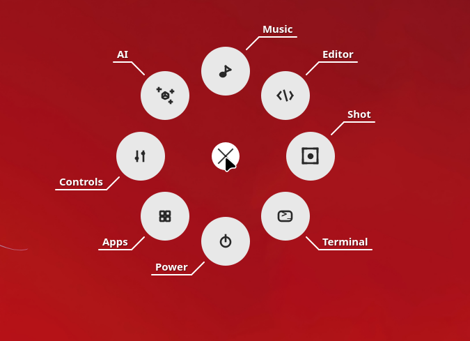

# Mouse Disc 🖱️

A radial/pie menu that appears on middle mouse click for quick shortcuts on Hyprland/Linux.



## Features

- 🎯 Radial menu with smooth animations
- 🎨 Customizable colors and actions
- ⌨️ Keyboard navigation (ESC to close)
- 🔧 Hyprland native integration
- 📦 System tray support

## Installation

```bash
# Install dependencies
pip install -r requirements.txt

# Or with pacman
sudo pacman -S python-pyqt6
```

## Usage

### Run directly:
```bash
python3 main.py
```

### With middle-click activation (Hyprland):

Add to your `hyprland.conf`:

```conf
# For keyboard shortcut
bind = $mainMod, M, exec, python3 ~/Projects/mouse-disc/main.py --show

# For mouse button (requires xmouseless or similar)
bind = , mouse:274, exec, python3 ~/Projects/mouse-disc/main.py --show
```

Or use the provided window rules in `hyprland-integration.conf`.

## Configuration

Edit `~/.config/mouse-disc/config.json`:

```json
{
  "items": [
    {
      "id": "browser",
      "label": "Browser",
      "icon": "",
      "action": "firefox",
      "action_type": "app",
      "color": "#e06c75"
    },
    {
      "id": "terminal",
      "label": "Terminal",
      "icon": "",
      "action": "kitty",
      "action_type": "app",
      "color": "#98c379"
    }
  ],
  "settings": {
    "inner_radius": 40,
    "outer_radius": 140,
    "font_size": 11,
    "animation_duration_ms": 200,
    "show_labels": true
  }
}
```

### Action Types

- `app` - Launch an application
- `command` - Run a shell command
- `hyprland` - Hyprland IPC command (e.g., "kill", "dispatch workspace")
- `media` - Media controls (play-pause, next, previous, volume +/-5%)

## Auto-start

Add to your Hyprland startup:

```conf
exec-once = python3 ~/Projects/mouse-disc/main.py
```

## License

MIT
